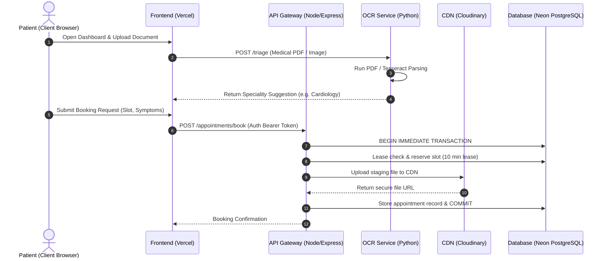

# HealthConnect — Full-Stack Healthcare Booking, Chat & Sandboxed AI Triage Platform

[](https://healthconnect-app-eta.vercel.app)
[](https://healthconnect-healthcare-appointment-consultatio-production.up.railway.app)
[](https://healthconnect-ocr-service-production.up.railway.app)
[](https://neon.tech)
[](https://cloudinary.com)

HealthConnect is a production-grade, full-stack medical consulting and appointment booking platform built to match industry-standard SaaS architectures. Designed as a high-performance system for software engineering placements, it decodes complex business requirements (pessimistic slot leasing, secure escrow payment states, OCR document processing, and real-time medical chat context) into a modular, containerized multi-tier ecosystem.

---

## 🚀 Live Production Links

* **Live Frontend Website**: [https://healthconnect-app-eta.vercel.app](https://healthconnect-app-eta.vercel.app)
* **Live API Backend Gateway**: [https://healthconnect-healthcare-appointment-consultatio-production.up.railway.app](https://healthconnect-healthcare-appointment-consultatio-production.up.railway.app)
* **Live OCR & AI Triage Microservice**: [https://healthconnect-ocr-service-production.up.railway.app](https://healthconnect-ocr-service-production.up.railway.app)

---

## 🏗️ System Architecture & Data Flow

HealthConnect uses a microservice-based architecture designed for high availability, clean separation of concerns, and decoupled scalability.

### Architecture Topology Map

```text
                                  +------------------------------------+
                                  |      Client Browser / React SPA    |
                                  |      (Deployed on Vercel CDN)      |
                                  +------------------------------------+
                                     /                              \
                      (HTTPS / JSON)/                                \ (HTTPS / Multipart Form)
                                   v                                  v
       +------------------------------------+        +------------------------------------+
       |       Express API Gateway          |        |       Flask OCR Microservice       |
       |       (Deployed on Railway)        |        |       (Deployed on Railway)        |
       +------------------------------------+        +------------------------------------+
           /                  |           \                             |
   (SQL)  /                   |            \ (Upload File)              | (Scan / OCR parsing)
         v                    v             v                           v
  +--------------+    +--------------+    +--------------+      +--------------+
  | Neon Cloud   |    | Local Disk   |    | Cloudinary   |      | Tesseract    |
  | PostgreSQL   |    | SQLite file  |    | CDN Storage  |      | OCR Engine   |
  | (Production) |    | (Dev Mode)   |    | (Production) |      | (Sandboxed)  |
  +--------------+    +--------------+    +--------------+      +--------------+
```

### System Sequence Diagram



---

## 🛠️ The Tech Stack

### 1. Frontend (React SPA)
* **Core**: React 19 (Create React App workflow).
* **Styling**: Premium, responsive Vanilla CSS with variables and custom dark/light theme properties.
* **State Management**: React Context API + Custom Hooks (clean separation of UI view and API interactions).
* **HTTP Client**: Axios (configured with response interceptors for global authentication redirects).

### 2. Backend (Node.js API Gateway)
* **Core**: Express.js, Async/Await error wrapper.
* **Security & Auth**: JWT (JSON Web Tokens) with route-level security, Bcrypt password hashing.
* **File Uploads**: Multer config mapped directly to Cloudinary CDN for persistent document delivery.
* **Database Driver**: Hybrid configuration supporting **PostgreSQL** in production (Neon Cloud) and **SQLite** locally for zero-setup offline development.

### 3. OCR Microservice (Python Flask)
* **Core**: Flask, Flask-CORS.
* **OCR Engines**: PyTesseract (dynamic binary location check) + PyPDF (combines image and digital document scanning).
* **Triage Analysis**: Ollama local LLM integration with an automated keyword speciality router fallback for serverless cloud environments.

---

## 💎 Core Architectural & Placement Highlights

### 1. Pessimistic Slot Leasing (Anti-Double Booking)
To prevent two patients from booking the same doctor's slot simultaneously, the service layer implements a database-level transaction lock (`BEGIN IMMEDIATE TRANSACTION`). Upon slot selection, the slot is leased to the patient for 10 minutes. A background cron worker periodically scans the database every 30 seconds to release expired slot locks (`createdAt < NOW() - INTERVAL '10 minutes'`) if the checkout payment has not been completed.

### 2. Cloudinary CDN & Hybrid Storage
During appointment booking, patients can upload medical records. Rather than saving to volatile container disks, the backend uploads the file to Cloudinary, stores the CDN URL in the database, and deletes the local staging file. If Cloudinary credentials are omitted in development, the helper automatically falls back to local folder serving (`/uploads`), maintaining offline testability.

### 3. Escrow Revenue Split Model
The platform handles appointment fees conceptually using an escrow model. Funds are held in escrow (`paymentStatus = Successful`, `escrowStatus = held`) until the doctor conducts the consultation and submits a prescription. Once submitted, the system releases the escrow (`escrowStatus = released`), calculating a 10% platform service fee and depositing the remaining 90% payout balance directly into the doctor's withdrawable wallet ledger.

---

## 📈 Database Schema Overview

The database is built on top of a highly optimized table structure:

* **`users`**: Patient credentials, contact info, age, and gender parameters.
* **`doctors`**: Specialization fields, balance ledger, slot timings, availability parameters, and administrative audit statuses (`pending` | `approved`).
* **`vendors`**: Pharmacies managing inventory grids (items, stock quantity, prices) and earnings.
* **`appointments`**: Central transactional records containing lease lock logs, symptom tags, fees, prescriptions, and medical report references.
* **`orders`**: Direct patient-to-pharmacy split transactions detailing drug lists, total amounts, delivery coordinates, and status pipelines (`Pending` | `Preparing` | `Dispatched` | `Received`).
* **`messages`**: Chronological chat logs mapping patient-doctor consult histories.
* **`medicine`**: Reference tables linking drug listings directly to specialty clinical departments (used for OCR matching).

---

## 💻 Local Development Setup

### Prerequisites
* Node.js (v18 or higher)
* Python (3.10 or higher)
* Tesseract-OCR binary (Only if testing local OCR on Windows)

### 1. Start Node.js Backend Gateway
```bash
cd backend
npm install
# Configure your variables in .env (see .env.example)
npm start
```

### 2. Start OCR Python Microservice
```bash
cd ocr_service
pip install -r requirements.txt
python app.py
```

### 3. Start React Frontend
```bash
cd frontend
npm install
# Set REACT_APP_API_BASE_URL=http://localhost:5000
# Set REACT_APP_OCR_BASE_URL=http://localhost:5001
npm start
```

---

## 🔒 Security Measures Checked
* **JWT Enforced Whitelisting**: Unprotected public endpoints are strictly whitelisted; all other routes check authorization headers.
* **JWT Expiry Hard-fail**: Node.js actively throws an exception on boot in production if the JWT secret is left as default.
* **SQL Injection Prevention**: Parameterized queries are enforced across the repository layer.
* **Upload Sanitization**: Multer cleans original filenames by appending a secure hash, restricting file extensions, and checking file sizes.
